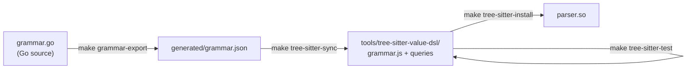

## Entry Points

| Command                   | Binary            | Makefile target       |
| ------------------------- | ----------------- | --------------------- |
| `cmd/dsl-cli`             | `./bin/dsl`       | `make build`          |
| `cmd/dsl-cli` + LSP tag   | `./bin/dsl-full`  | `make build-full`     |
| `cmd/dsl-lsp`             | `./bin/dsl-lsp`   | `make lsp`            |
| `cmd/dsl-langspec-export` | _(not installed)_ | `make grammar-export` |

`cmd/dsl-langspec-export` writes `generated/grammar.json` and is only used internally by the tree-sitter pipeline. It is not distributed as a user-facing binary.

`make build` intentionally builds the standalone CLI without the embedded `dsl lsp` command. Use `make build-full` when you want one binary that includes both CLI commands and the language server as `dsl-full lsp`. For a combined binary literally named `dsl`, run `make build-full FULL_BIN=./bin/dsl`. The combined binary is larger because Go links the CLI package graph and the GLSP/LSP package graph into the same executable.

All binary build targets use `-trimpath -ldflags "-s -w"` by default to remove local path metadata, the symbol table, and DWARF debug data. Override `GO_BUILD_FLAGS` or `GO_LDFLAGS` when you need debuggable binaries.

## Makefile Targets

| Target                | What it does                                                      |
| --------------------- | ----------------------------------------------------------------- |
| `build`               | Compile standalone `cmd/dsl-cli` → `./bin/dsl`                    |
| `build-full`          | Compile `cmd/dsl-cli` with `dsl_lsp` tag → `./bin/dsl-full`       |
| `lsp`                 | Compile `cmd/dsl-lsp` → `./bin/dsl-lsp`                           |
| `test`                | `go test ./...`                                                   |
| `test-full`           | Test the tagged combined CLI/LSP build                            |
| `fmt`                 | `gofmt -w` all Go files                                           |
| `check`               | `gofmt -l` all Go files; exits 1 if any differ (CI gate)          |
| `parse`               | Run `dsl parse` on `FILE=`                                        |
| `validate`            | Run `dsl validate` on `FILE=`                                     |
| `analyze`             | Run `dsl analyze` on `FILE=`                                      |
| `grammar-export`      | Export `generated/grammar.json` from Go grammar source            |
| `tree-sitter-sync`    | Regenerate `grammar.js` and queries from `generated/grammar.json` |
| `tree-sitter-test`    | Run drift check + tree-sitter corpus tests                        |
| `tree-sitter-install` | Compile `parser.so` and copy to `TS_PARSER_DIR`                   |
| `tree-sitter`         | Full pipeline: sync + test + install                              |
| `full`                | `test` + `test-full` + all binaries + `tree-sitter`               |
| `clean`               | Remove `./bin/`                                                   |

<Callout type="info">
  The Makefile is POSIX-oriented rather than fully OS-independent. It works on
  macOS/Linux and usually under WSL, Git Bash, or MSYS2 on Windows, but it uses
  `/bin/sh`, `find`, `rm`, `cat`, Unix paths, and `.so` parser artifacts, so it
  is not native `cmd`/PowerShell compatible as-is.
</Callout>

## Tree-sitter Pipeline



- `make grammar-export` runs `cmd/dsl-langspec-export` to serialize the Go grammar to JSON
- `make tree-sitter-sync` reads the JSON and regenerates `grammar.js` and query files
- `make tree-sitter-test` checks that `grammar.js` matches `grammar.json` (drift check) and runs corpus tests
- `make tree-sitter-install` compiles and installs `parser.so`

**`TS_PARSER_DIR`** controls the install destination (default: `~/.local/share/nvim/lazy/nvim-treesitter/parser`):

```bash
TS_PARSER_DIR=/custom/path make tree-sitter-install
```

## Generated Files

Never edit these by hand — they are overwritten by `make tree-sitter-sync`:

| File                                                 | Generated by            |
| ---------------------------------------------------- | ----------------------- |
| `generated/grammar.json`                             | `make grammar-export`   |
| `tools/tree-sitter-value-dsl/grammar.js`             | `make tree-sitter-sync` |
| `tools/tree-sitter-value-dsl/queries/highlights.scm` | `make tree-sitter-sync` |
| `tools/tree-sitter-value-dsl/queries/indents.scm`    | `make tree-sitter-sync` |
| `tools/tree-sitter-value-dsl/queries/folds.scm`      | `make tree-sitter-sync` |

## Testing

```bash
go test ./...
```

Covers all packages. Benchmark tests live in `internal/bench/`.

Individual package tests:

```bash
go test ./internal/validation/...
go test ./internal/semantic/...
go test ./internal/analysis/...
go test ./internal/lsp/...
```

## CI Checklist

```bash
make check    # gofmt — fails if any file is not formatted
make test     # all tests
make full     # tests, all binaries, and tree-sitter (for release verification)
```

For a clean CI gate: `make check && make test` is the minimum. `make full` is recommended before tagging a release to verify the tree-sitter pipeline is in sync.
