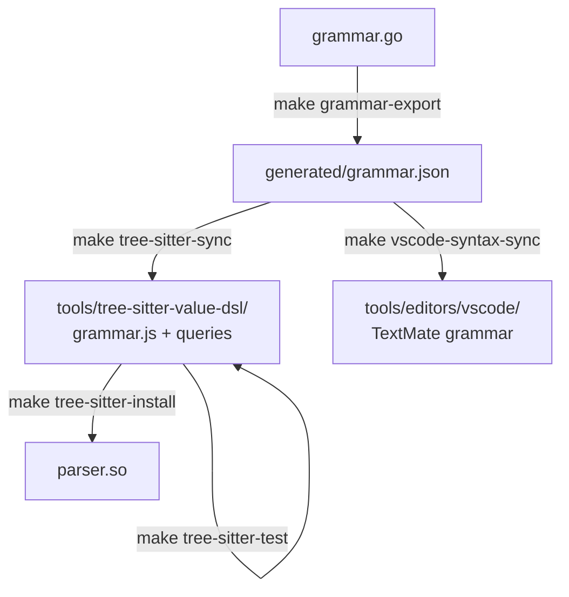

## Editor Grammar Pipeline



- `make grammar-export` runs `cmd/dsl-langspec-export` to serialize the Go grammar to JSON
- `make tree-sitter-sync` reads the JSON and regenerates `grammar.js` and query files
- `make tree-sitter-test` checks that `grammar.js` matches `grammar.json` and runs corpus tests
- `make tree-sitter-install` compiles and installs `parser.so`
- `make vscode-syntax-sync` regenerates the VS Code TextMate grammar from the same JSON
- `make editor-sync` updates both Tree-sitter and VS Code generated grammar assets

`TS_PARSER_DIR` controls the Tree-sitter parser install destination. The
default is:

```text
~/.local/share/nvim/lazy/nvim-treesitter/parser
```

`TS_QUERIES_DIR` controls where the generated Neovim query files are installed.
The default is:

```text
~/.config/nvim/queries/value_dsl
```

Use a custom location when needed:

```bash
TS_PARSER_DIR=/custom/parser/path TS_QUERIES_DIR=/custom/queries/value_dsl make tree-sitter-install
```

## Generated Files

Never edit these by hand; they are overwritten by the sync targets.

| File                                                      | Generated by              |
| --------------------------------------------------------- | ------------------------- |
| `generated/grammar.json`                                  | `make grammar-export`     |
| `tools/tree-sitter-value-dsl/grammar.js`                  | `make tree-sitter-sync`   |
| `tools/tree-sitter-value-dsl/queries/highlights.scm`      | `make tree-sitter-sync`   |
| `tools/tree-sitter-value-dsl/queries/indents.scm`         | `make tree-sitter-sync`   |
| `tools/tree-sitter-value-dsl/queries/folds.scm`           | `make tree-sitter-sync`   |
| `tools/editors/vscode/syntaxes/value-dsl.tmLanguage.json` | `make vscode-syntax-sync` |
