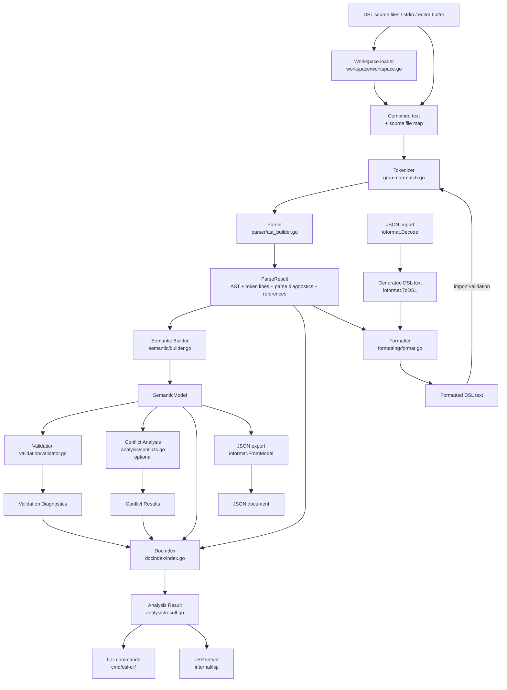
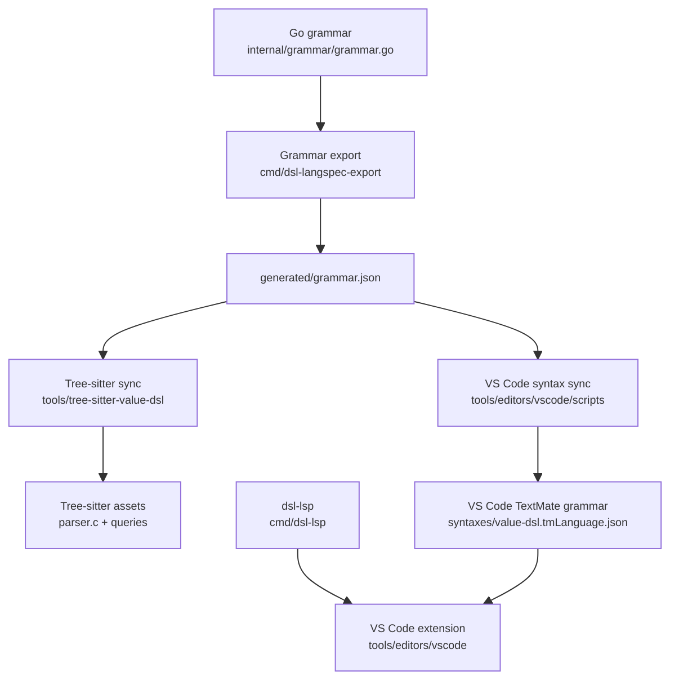

value-dsl is a Go compiler + LSP server. Text enters as a raw string and exits
as diagnostics, optional conflict scores, formatted text, import/export output,
or LSP responses. The core parser, semantic builder, validation, and conflict
analysis layers are deterministic transformations over their inputs. The LSP
server adds state at the editor boundary: open documents, debounce,
analysis caching, and workspace loading.

## Runtime Pipeline

`analysis.Run()` orchestrates the canonical pipeline. It first builds a
parse-only `DocIndex` so parse diagnostics are available even if semantic
building fails. After a successful semantic build, it validates the model, runs
conflict analysis only when `Options.BuildConflicts` is enabled, and rebuilds
the index with the AST, token lines, semantic model, parse diagnostics,
validation diagnostics, conflicts, and parser references.

The workspace loader is the file boundary for normal CLI and LSP analysis. It
combines a `main.dsl` workspace into one source string and records source-file
ranges so diagnostics can be mapped back to their original files. Standalone
files, `_lone` files, stdin, and editor buffers outside a workspace bypass that
merge step.

The CLI consumes the resulting `analysis.Result`: `validate` reports
diagnostics, `analyze` enables conflict generation and prints conflicts, and
`export` converts the semantic model through `ioformat`. `import` runs in the
opposite direction: JSON is decoded into an interchange document, rendered back
to DSL text, formatted, and then analyzed for validation. The LSP server also
consumes `analysis.Result`, but caches it per open document and uses fallback
navigation data from the last good index when the current text is temporarily
invalid.

## Editor Grammar Pipeline

Tree-sitter and VS Code syntax highlighting are separate from the runtime
parser. Both are generated from the same Go grammar source through
`cmd/dsl-langspec-export` and `generated/grammar.json`: Tree-sitter uses the
scripts in `tools/tree-sitter-value-dsl`, while VS Code uses
`tools/editors/vscode/scripts/generate-textmate.mjs` to regenerate its TextMate
grammar. The CLI and LSP do not parse with either editor grammar.

The VS Code extension is an editor boundary around the same `dsl-lsp` server.
Its syntax layer comes from the generated TextMate grammar, and its language
features come from spawning `dsl-lsp` through the LSP client.

## Package Inventory

| Package                       | Purpose                                            | Key exported types                                                         |
| ----------------------------- | -------------------------------------------------- | -------------------------------------------------------------------------- |
| `internal/grammar`            | DSL grammar definition and runtime compilation     | `Spec`, `CompiledSpec`, `TokenLine`                                        |
| `internal/parser`             | AST construction from token lines                  | `ParseResult`, `ReferenceOccurrence`                                       |
| `internal/ast`                | AST node types                                     | `DocumentNode`, `DeclarationNode`, `GenericNode`                           |
| `internal/semantic`           | Semantic model builder                             | `SemanticModel`, `Build()`                                                 |
| `internal/model`              | Shared domain types                                | `Requirement`, `Stakeholder`, `Value`, `AssignmentEntry`, `ConflictResult` |
| `internal/validation`         | Semantic validation and diagnostics                | `Validate()`, `Diagnostic`, `DiagnosticCode`                               |
| `internal/analysis`           | Analysis pipeline orchestration + conflict scoring | `Run()`, `AnalyzeConflicts()`, `ConflictScore()`                           |
| `internal/docindex`           | Shared analysis/navigation index                   | `Document`, `Build()`                                                      |
| `internal/lsp`                | LSP server and feature handlers                    | `Server`, `NewServer()`                                                    |
| `internal/formatting`         | DSL formatter                                      | `Format()`, `FormatForWrite()`                                             |
| `internal/ioformat`           | Import/export interchange formats                  | `Document`, `Codec`, `Encode()`, `Decode()`                                |
| `internal/workspace`          | Multi-file workspace loading and source mapping    | `Document`, `LoadDocument()`, `LoadDocumentForOpenFiles()`                 |
| `internal/values`             | Schwartz value registry and geometry               | `All()`, `Categories()`, `LookupByName()`                                  |
| `internal/diagnostics`        | Diagnostic code catalog                            | `SpecFor()`                                                                |
| `internal/sourcepos`          | Source position and UTF-16 conversion              | `Position`, `Range`                                                        |
| `cmd/dsl-cli`                 | CLI entry point                                    | Cobra root command                                                         |
| `cmd/dsl-lsp`                 | LSP server entry point                             | —                                                                          |
| `cmd/dsl-langspec-export`     | Grammar JSON export                                | —                                                                          |
| `tools/tree-sitter-value-dsl` | Generated editor grammar and query assets          | `grammar.js`, `parser.c`, `queries/*.scm`                                  |
| `tools/editors/vscode`        | VS Code extension and generated TextMate grammar   | `extension.ts`, `syntaxes/value-dsl.tmLanguage.json`                       |

## Design Principles

**Grammar as data.** `internal/grammar/grammar.go` is the single source of truth for the DSL syntax. It is a declarative Go struct — no parsing logic lives there. The grammar is compiled once at startup into lookup tables via `Compile(spec)`.

**Minimal extension points.** Core compiler layers call concrete packages directly. Import/export is the exception: `internal/ioformat` uses a small codec registry so new interchange formats can be added without changing parser, validation, analysis, or CLI flow.

**Position tracking.** All source positions are 1-indexed `(line, column)` `sourcepos.Position` values inside the compiler. The LSP boundary converts to 0-indexed UTF-16 offsets as required by the LSP protocol.

**LSP analysis is cached.** The LSP server caches the last analysis result per document URI + content hash. Cache misses run the full pipeline. Navigation features (go-to-definition, rename) fall back to the last good index when the current parse is invalid.

## Go Module

Go 1.22. Direct dependencies:

| Dependency               | Purpose                 |
| ------------------------ | ----------------------- |
| `github.com/spf13/cobra` | CLI command framework   |
| `github.com/tliron/glsp` | LSP JSON-RPC SDK for Go |
| `golang.org/x/image`     | LSP benchmark graphing  |

## Section Pages

<Cards>
  <Card
    title="Grammar Layer"
    description="Matcher types, Decl/LineRule structs, and how to extend the grammar."
    href="/docs/dev/grammar-layer"
  />
  <Card
    title="Tokenizer & Parser"
    description="Tokenization internals, AST construction, and block grouping."
    href="/docs/dev/tokenizer-parser"
  />
  <Card
    title="Semantic Model"
    description="SemanticModel structure, Build() phases, and all model types."
    href="/docs/dev/semantic-model"
  />
  <Card
    title="Validation Layer"
    description="Validation pipeline, all 17 codes, and how to add new checks."
    href="/docs/dev/validation-layer"
  />
  <Card
    title="Conflict Analysis"
    description="Schwartz circle geometry, scoring formula, and analysis flow."
    href="/docs/dev/conflict-analysis"
  />
  <Card
    title="Document Index"
    description="The unified LSP read model and how navigation features use it."
    href="/docs/dev/document-index"
  />
  <Card
    title="LSP Server"
    description="Server internals, debounce logic, caching, and feature handler pattern."
    href="/docs/dev/lsp-server"
  />
  <Card
    title="LSP Benchmarking"
    description="lspbench setup, config schema, output formats, graphing, and metric interpretation."
    href="/docs/dev/lsp-benchmarking"
  />
  <Card
    title="Build & Tooling"
    description="Makefile targets, entry points, tree-sitter pipeline, and CI."
    href="/docs/dev/build-tooling"
  />
</Cards>
